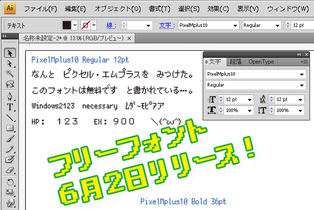

PixelMplus（ピクセル・エムプラス）
=================================

Copyright (C) 2013 itouhiro  
Copyright (C) 2002-2013 M+ FONTS PROJECT

Description
-----------

8bit風味のファミコンのビットマップフォントのような感じを出せる
TrueTypeアウトラインフォントです。

Feature
-------

- ビットマップフォントのように見えるが、アウトラインのみのTrueTypeフォント。
  埋め込みビットマップは なし。ボールド体（太字）あり。

- JIS第1・第2水準のすべての漢字を収録。ISO-8859-1(Latin-1)の文字も収録。
  そのほかにもいくつかの記号を追加。

- 実体は単なるTrueType等幅フォント。テキストエディターで使用することもできる。

- ライセンスは自由なM+ FONT LICENSE。

- PixelMplus12 と PixelMplus10　の2種類のフォントがあります。
  元にしたビットマップフォントが 12ピクセルであるか、10ピクセルであるか、の点が違います。

詳しくは以下を参照。  
http://itouhiro.hatenablog.com/entry/20130602/font

Thanks
------

PixelMplusは、ビットマップフォント [M+ BITMAP FONTS](http://mplus-fonts.sourceforge.jp/mplus-bitmap-fonts/) をアウトライン化したフォントです。
M+ FONTS PROJECTの皆さんありがとうございます。

License
-------

M+ FONT LICENSE

M+ FONT LICENSEについては、配布物に含まれる
[mplus_bitmap_fonts/LICENSE_E](misc/mplus_bitmap_fonts/LICENSE_E)
をご覧ください。
